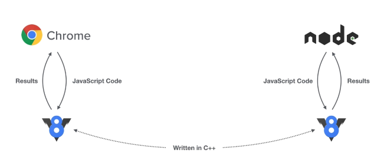
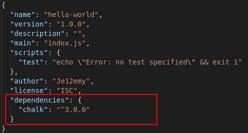
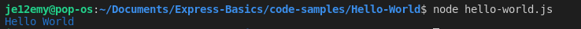
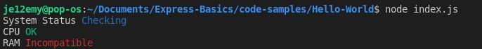
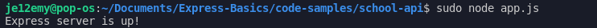
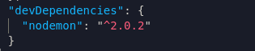

# Node/Express Basics

This is a small tutorial made for new Node.js developers, this aims to teach newcomers how to set up a express server for their next back-end.

[TOC]


## Introduction to Node.js

Before we develop our first node project we should at least learn what Node is.

### What is Node.js?

> Node.js® is a JavaScript runtime built on [Chrome's V8 JavaScript engine](https://v8.dev/). 

Node.js is a V8 wrapper which allows us to run JavaScript code in our computer  without the use of a web browser, it has access to many powerful API and access to the OS resources like the File System. Node is written in C++ 

While Node is mostly seen as plain JavaScript, it is executed in another way



Both Chrome and Node DO NOT know how to run/interpret JavaScript, they send  the code to the V8 engine which sends back the results. V8 is written in C++ this means that when we are sending code de V8 we are actually executing some C++ function and not JavaScript code. 


### Why use Node.js?

Everyday new developers are jumping into Node.js. Node is great for the whole stack. 

> Node.js uses an event-driven, non-blocking I/O model that makes it lightweight and efficient. 

"non-blocking I/O" means that Node will not interrupt the code execution while an  operation with the I/O is in progress say Querying a database, this  started in the browser where the blocking of the I/O would freeze the  whole web page. 

This means function execution will be overall better performance wise, since operations are not invoked in a linear fashion.


> Node.js' package ecosystem, npm, is the largest ecosystem of open source libraries in the world 

Node Package Manager, is a package manager which manages all of our  project's dependencies, this includes installing, un-installing, updating and maintaining our packets.  A package in a nutshell is someone's code which is uploaded into [npm.js' official website](https://www.npmjs.com/), here code is identified by a unique name. We can use this code however we wish to for our own applications or we can some else's package to develop our own packages.

### Installing Node.js

Node is available in Windows, Mac Os and most Linux distributions.

### Windows

On windows, just as any other installations download the executable from [Node.js's official website](https://nodejs.org/es/).

### Linux

On Linux you will receive a tar.gz file, but you can also use the snap store. Run the following command to install node:

```
sudo snap install node --channel=12/stable --classic
```

After installation we can check if node is installed by running

```
node -v
```

This is the expected output

```
v12.16.1
```

## Hello World

Let's write our first node application, to start off open your favorite text-editor. For this tutorial [Visual Studio Code](https://code.visualstudio.com/) will be used. In a new folder create a file named `hello-world.js`

```
mkdir hello-world
cd hello-world
touch hello-world.js
```

Open up a new terminal window and navigate towards this directory path. To start using Node, we need to initialize Node in this folder.

```
npm innit
```

After we run this command we will be prompted to fill up a form about this package we are creating, you may fill it as you wish.

```
Press ^C at any time to quit.
package name: (hello-world) 
version: (1.0.0) 
description: 
entry point: (index.js) 
test command: 
git repository: 
keywords: 
author: Je12emy
license: (ISC) 
```

We can also skip this configuration by using the default values using the command

```
npm innit --yes
```

Afterwards we will be shown the basic information for this package

```
About to write to /home/je12emy/Documents/Express-Basics/code-samples/Hello-World/package.json:

{
  "name": "hello-world",
  "version": "1.0.0",
  "description": "",
  "main": "index.js",
  "scripts": {
    "test": "echo \"Error: no test specified\" && exit 1"
  },
  "author": "Je12emy",
  "license": "ISC"
}


Is this OK? (yes) 
```

If you check you file structure you may notice a new file has been created: `package.json`

```
.
├── hello-world.js
└── package.json

0 directories, 2 files
```

`package.json` displays basic information about our package and it's dependencies (other packages which are used). This is key for collaborating with other developers, since all they need to do is install all the decencies needed with a simple command and they will be able to work along in our application. For now let's focus on `hello-world.js`.

Open up `hello-world.js`, remember we pretty much are working with JavaScript so all previous knowledge will transfer nicely into Node. For now let's just print "Hello World".

```javascript
console.log('Hello World');
```

### Executing Code

 Simply navigate into this folder path and run the command:

```
node <filename>
```

Now call the file and the message "Hello World" should show up.

```
je12emy@pop-os:~/Documents/Hello-World$ node hello-world.js 
Hello World
```

## Using NPM Modules

We mentioned the NPM ecosystem is a great incentive for using Node. This allows us to use someone else's code in our own application and allow NPM to handle updates and dependencies it may need later on in the future. Following up on our Hello World project we will use a module named [Chalk](https://www.npmjs.com/package/chalk) which allows us to print messages in the terminal with some extra decorations.

### Installing a Module

We can check a module's information over at [NPM's official](https://www.npmjs.com/) website and look for a specific module we wish to use in our project, as mentioned before we will be using [Chalk](https://www.npmjs.com/package/chalk). Here we can see the official documentation for this module, to install a module navigate into the folder in your terminal and run the command:

```
npm install chalk
```

This command is always provided in the module's page, also we can shorten this command by using `i` instead of `install`

```
npm i chalk
```

 After executing this command you should see a progress bar for the installation, after this is done Chalk should be installed. Remember we `package.json` contains our dependencies, this means Chalk is now a dependency for our project and it should show up.



Also a new file should show up named `package-lock.json`, this file is responsible for making sure the proper module version is installed when we install our dependencies.

### Using Chalk

To use a module, we simply import it into our application. This is done by using the `required` keyword, which imports a object exported by the node module which we installed. Then we store this object into a variable.

```javascript
const chalk = require('chalk')
```

To use chalk we simply access a function inside this object, here we will style for this console output into printing a blue message.

```javascript
console.log(chalk.blue('Hello World'));
```

This should be the output, after executing the file. 



## Exporting a Module

Since writing all of our code in a single file would not be maintainable in the long run, to do this we simply create and export our own modules which we can import in a separate file.

Let's follow up on the Hello World project sample, we will create a separate file where we will make our functions calls. In `hello-world.js` we will create a couple of functions which will print a header and a colored message.

```javascript
const chalk = require('chalk')

const blueMsg = (header,msg) =>  {
    console.log(header, chalk.blue(msg));
}

const greenMsg = (header,msg) =>  {
    console.log(header, chalk.green(msg));
}

const redMsg = (header,msg) => {
    console.log(header, chalk.red(msg));
}
```

If you are not familiar with this syntax for defining a function this is called a Arrow Function, it allows us to assign a function to a variable, this has many benefits mainly the `.this` scope in contained within this function.

Now we need to export these functions, the popular way to this is exporting them all in a single object and using the `module.exports` function.

```javascript
module.exports = {
    blueMsg,
    greenMsg,
    redMsg: redMsg
}
```

As you can see we can either use the function name as a object property (known as short hand notation) or create a new property and assign the function name.

Moving on, in a new file named `index.js` we will import this function and make us of this functions. When we import our own modules remember we need to access them through their file path in our project.

```javascript
const colorPrinter = require('./hello-world')
```

Now we have access to all this methods inside the `colorPrinter` variable. Let's write a little system diagnosis log.

```javascript
colorPrinter.blueMsg('System Status', 'Checking')
colorPrinter.greenMsg('CPU', 'OK')
colorPrinter.redMsg('RAM', 'Incompatible')
```

This is how things should look like.



## Express.js

With this basic knowledge we should be able to write our very own express server application,  express allows us to create a server with pretty much minimal configuration. Express is one of most popular options out there and it is compatible with many popular frameworks like React (Front-end), Jest (Unit-Testing), Apollo (GraphQL implementation). Actually many stacks written in Node use express in some way or another, the most popular options  being a MERN Stack, for Mongo, Express, React and Node.


### Installing Express

Just as Chalk, [Express](https://www.npmjs.com/package/express) is served as a npm package. To learn Express we will be creating a new project named ,create a new folder and initiate Node in this folder. To install Express we run the command

```
npm i express
```

### Using Express

To start using Express we import the package into our project and instantiate this package

```javascript
const express = require('express')
const app = express()
```

Now we need to set up a port for our server to listed for requests. To do this we create a variable named `PORT`, then we use the function `listed` and pass in a port number and a function to be executed after the server initialization is successful.

```javascript
const PORT = 80
app.listen(PORT, () => {
    console.log('Express server is up!');  
})
```

Now execute this file, and we should get the following output.



#### Our first end-point

An end-point is a certain route which our server will listening for, and after a certain HTTP protocol (GET, POST, DELETE, PUT) it will perform a certain operation. Let's create a route for the end-point `/students` which will return a list of students in a school.

In every endpoint we pass in the route which we will be listening for and the function to be executed. This second function has access to two arguments: request and response. Request refers to the request for this end-point, it can contains certain data which it wishes to pass in. Response is the response the server sends back.

Add this code before the `app.listen()` function.

```javascript
app.get('/students', (req, res) => {
    res.send('Student API')
})
```

Make sure you restart the server after creating this code, and access the server with the URL: `localhost:80/students` on your browser, do make sure you use the port number you had set up previously. You should be seeing the message "Student API" showing in your window.

### Nodemon and Development Dependencies

There are certain packages which are only useful for developers, [Nodemon](https://www.npmjs.com/package/nodemon) is a great example for this use case. Nodemon is a package which restarts the server whenever it detects a change in our code, while it isn't mandatory to use, it makes the work flow much easier. To install Nodemon run the command

```
npm i nodemon --save-dev
```

This will create a new object in the `package.json`



From here we can use

```
npm nodemon app.js
```

But we can actually simply this by using our own script which will execute the file using Nodemon. In `package.json` make the following modifications

```json
  "scripts": {
    "test": "echo \"Error: no test specified\" && exit 1",
    "dev": "nodemon app.js"
  }
```

This creates a script named `dev` which uses Nodemon to execute `app.js`. To run this script we use

``` 
npm run dev
```

After running this, your output should look different.

```
> nodemon app.js

[nodemon] 2.0.2
[nodemon] to restart at any time, enter `rs`
[nodemon] watching dir(s): *.*
[nodemon] watching extensions: js,mjs,json
[nodemon] starting `node app.js`
Express server is up!
```